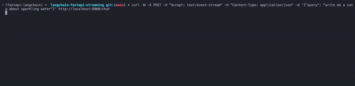

# fastapi-async-langchain

[](https://github.com/ajndkr/fastapi-async-langchain/blob/main/LICENSE)
[](https://pypi.org/project/fastapi-async-langchain/)

Ship production-ready [LangChain](https://github.com/hwchase17/langchain) projects with [FastAPI](https://github.com/tiangolo/fastapi).

## :rocket: Features

- supports token streaming over HTTP and Websocket
- supports multiple langchain `Chain` types (ongoing...)
- simple gradio chatbot UI for fast prototyping

## 💾 Installation

The library is available on PyPI and can be installed via `pip`.

```bash
pip install fastapi-async-langchain
```

## 🎯 Demo Examples

See [`examples/`](examples/README.md) for list of available demo examples.

Create a `.env` file using `.env.sample` and add your OpenAI API key to it
before running the examples.



## 🤝 Contributing

[](https://github.com/ajndkr/fastapi-async-langchain/actions/workflows/code-check.yaml)
[](https://github.com/ajndkr/fastapi-async-langchain/actions/workflows/publish.yaml)

Contributions are more than welcome! If you have an idea for a new feature or want to help improve fastapi-async-langchain, please create an issue or submit a pull request
on [GitHub](https://github.com/ajndkr/fastapi-async-langchain).

See [CONTRIBUTING.md](./CONTRIBUTING.md) for more information.

## ⚖️ License

The library is released under the [MIT License](https://github.com/ajndkr/fastapi-async-langchain/blob/main/LICENSE).
