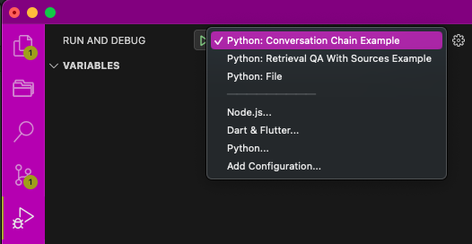

# Demo Examples

This directory contains a list of demo examples of FastAPI applications for various langchain use cases.

## Setup Instructions

The app is built with Python 3.9. Clone this repository and follow the steps below
to get started.

### Create conda environment:

```bash
conda create -n demo-examples python=3.9 -y
conda activate demo-examples
```

You can choose any other environment manager of your choice.

### Install dependencies:

```bash
pip install -r requirements.txt
```

## Usage

### Run the application

To run a demo example, select the command based on the langchain use case you want to try out.

- Conversation Chain: `uvicorn app.conversation_chain:app --reload`
- Retrieval QA with Sources Chain: `uvicorn app.retrieval_qa_chain:app --reload`

You can also use the "Run & Debug" VSCode feature to run one of the applications.



### Sample cURL request

```bash
curl -N -X POST \
-H "Accept: text/event-stream" -H "Content-Type: application/json" \
-d '{"query": "Give me list of text splitters available with code samples" }' \
http://localhost:8000/conversation_chain/chat
```

### Gradio UI

Open http://localhost:8000/gradio in your browser to access the Gradio UI.

### Websocket Testing

Open http://localhost:8000 in your browser to access the chatbot UI with websocket support.
